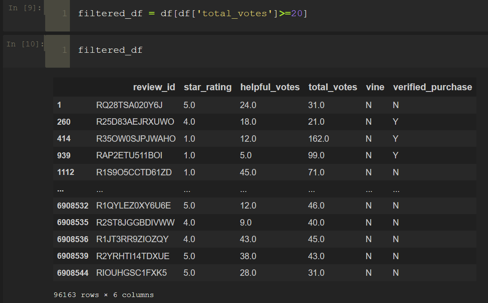
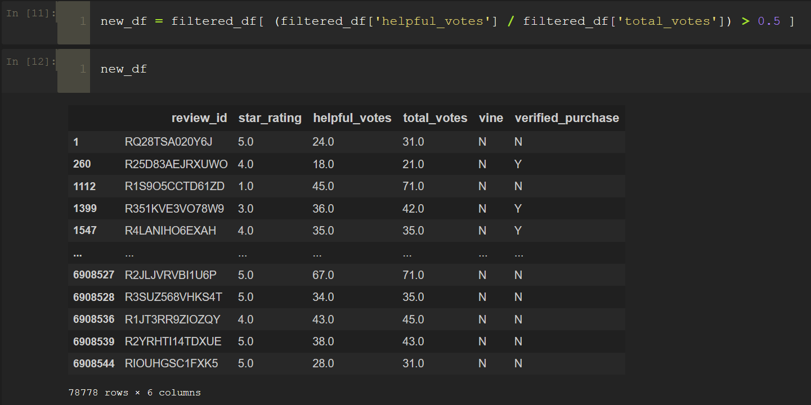
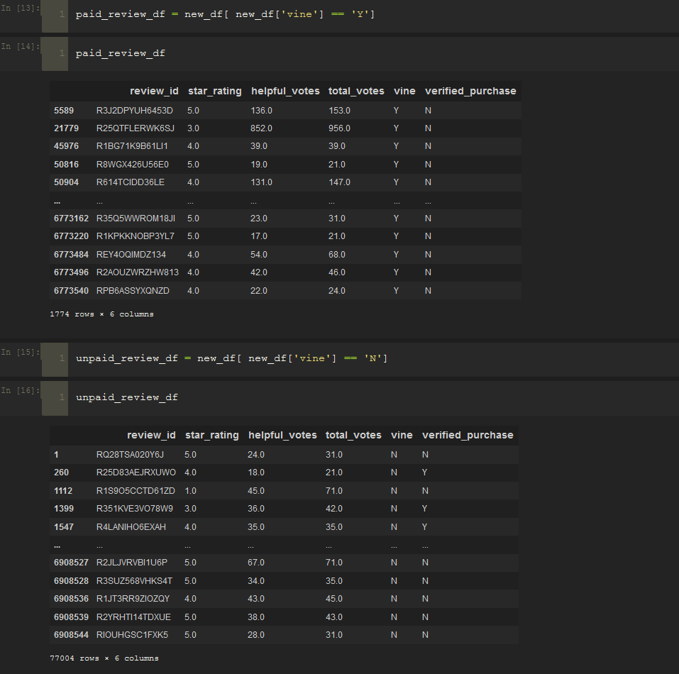

# Amazon_Vine_Analysis
Data Analytics Boot Camp Challenge 16

## Overview of the analysis

The objective of this project is analyzing Amazon reviews written by members of the paid Amazon Vine program. The Amazon Vine program is a service that allows manufacturers and publishers to receive reviews for their products. Companies like SellBy pay a small fee to Amazon and provide products to Amazon Vine members, who are then required to publish a review.

In this project, we're analyzing reviews for the ***PCs*** category by first performing the ETL process to extract the dataset, transform the data, connect to an AWS RDS instance, and load the transformed data into pgAdmin. After that, we're using Pandas to determine if there is any bias toward favorable reviews from Vine members in the dataset.

## Results

Below are snap shots of the dataframes:

Reviews with total votes greater than 20:

Reviews with helpful reviews percentage is greater than 50% of total reviews for the above list:

Snap shot of dataframes of paid/unpaid reviews:

---

