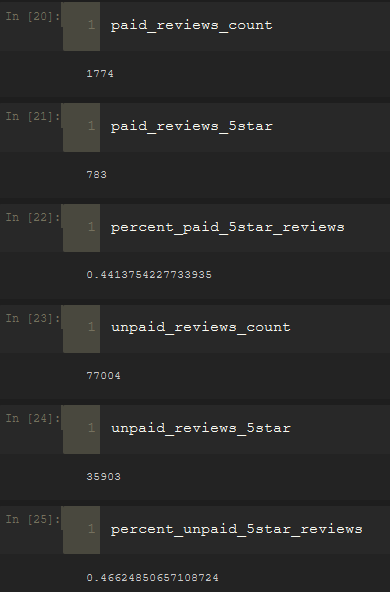

# Amazon_Vine_Analysis
Data Analytics Boot Camp Challenge 16

## Overview of the analysis

The objective of this project is analyzing *Amazon* reviews written by members of the paid *Amazon Vine program*. The *Amazon Vine program* is a service that allows manufacturers and publishers to receive reviews for their products. Companies like *SellBy* pay a small fee to *Amazon* and provide products to *Amazon Vine* members, who are then required to publish a review.

In this project, we're analyzing reviews for the ***PCs*** category by first performing the ETL process to extract the dataset, transform the data, connect to an *AWS RDS* instance, and load the transformed data into *pgAdmin*. After that, we're using *Pandas* to determine if there is any bias toward favorable reviews from *Vine* members in the dataset.

## Results

### Below are snap shots of the dataframes:

Reviews with total votes greater than 20:

Reviews with helpful reviews percentage is greater than 50% of total reviews for the above list:

Snap shot of dataframes of paid/unpaid reviews:

Following image displays findings:

- Total number of vine (paid) reviews is: `1,774`
- Total number of non-vine (unpaid) reviews is: `77,004`
- Total 5-star vine reviews: `783`
- Total 5-star non-vine reviews: `35,903`
- `44%` of vine reviews were 5-star
- `47%` of non-vine reviews were 5-star

## Summary

Based on the findings from the analysis, I can confidently state that no bias for *Vine* reviews was detected. The reason is both *Vine* and *Non-Vine* reviews almost have the same percentage for 5-star ratings.

Another analysis I would perform to re-confirm my findings would be to analyze all rating stars (1 to 5) instead of 5 only.

---

